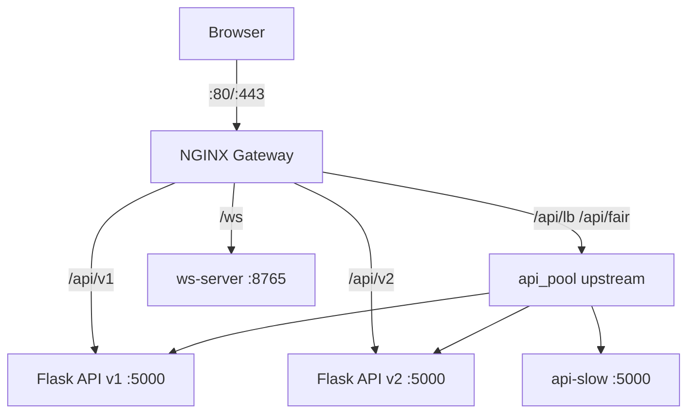

# NGINX Lab — DevOps Infrastructure

Практикум по конфигурированию NGINX как reverse proxy, балансировщика нагрузки, HTTPS-терминатора и WebSocket-прокси. Весь стек запускается одной командой через Docker Compose.

---

## Архитектура

```
Клиент (браузер / curl)
        │
        ▼
┌───────────────────┐
│  NGINX 1.25       │  :80 / :443
│  (Gateway)        │
└──┬──┬──┬──┬──────┘
   │  │  │  │
   │  │  │  └── ws_server:8765   (WebSocket)
   │  │  └───── api_slow:5000    (медленный сервис)
   │  └───────── api_v2:5000     (Flask green)
   └──────────── api_v1:5000     (Flask blue)
```



---

## Быстрый старт

```bash
git clone <repo>
cd nginx-lab

# Запустить все сервисы
docker-compose up --build -d

# Проверить статус
docker-compose ps
```

Добавьте в `/etc/hosts` (или `C:\Windows\System32\drivers\etc\hosts`):
```
127.0.0.1  api.localhost secure.localhost ws.localhost
```

Откройте [http://localhost](http://localhost) в браузере.

---

## Сервисы

| Сервис | URL | Описание |
|--------|-----|----------|
| Static | http://localhost/ | Главная страница |
| API v1 | http://api.localhost/api/v1/info | Flask blue |
| API v2 | http://api.localhost/api/v2/info | Flask green |
| LB | http://api.localhost/api/lb/info | Round-robin (75/25) |
| Cached | http://api.localhost/api/cached/info | Proxy cache 30s |
| HTTPS | https://localhost/ | TLS 1.2/1.3 |
| Security | http://secure.localhost/ | Rate limit + headers |
| WebSocket | ws://ws.localhost/ws | Echo WS |
| Prometheus | http://localhost:9090 | Метрики |
| NGINX status | http://localhost/nginx_status | Статистика |

---

## Конфигурационные файлы

| Файл | Задание | Описание |
|------|---------|----------|
| `nginx/nginx.conf` | 1, 9 | Глобальный конфиг, gzip, JSON-логи |
| `nginx/conf.d/default.conf` | 1, 2 | Статика, редиректы, rewrite |
| `nginx/conf.d/proxy.conf` | 3, 4, 7 | Reverse proxy, upstream, кэш |
| `nginx/conf.d/ssl.conf` | 5 | HTTPS, TLS 1.2/1.3 |
| `nginx/conf.d/security.conf` | 6 | Rate limit, security headers, Basic Auth |
| `nginx/conf.d/ws.conf` | 8 | WebSocket proxy |

---

## Полезные команды

```bash
# Перезагрузить конфиг без перезапуска
docker exec nginx_gateway nginx -s reload

# Проверить конфиг
docker exec nginx_gateway nginx -t

# Логи NGINX
docker-compose logs -f nginx

# Войти в контейнер
docker exec -it nginx_gateway sh

# Смотреть JSON-логи
docker exec nginx_gateway tail -20 /var/log/nginx/access.log | python3 -m json.tool

# Экспортировать лог
docker cp nginx_gateway:/var/log/nginx/access.log ./access.log

# Топ-5 медленных запросов
docker exec nginx_gateway sh -c "cat /var/log/nginx/access.log | python3 -c \"
import sys, json
lines = [json.loads(l) for l in sys.stdin if l.strip()]
top = sorted(lines, key=lambda x: float(x.get('duration',0)), reverse=True)[:5]
for r in top: print(f\\\"{r['duration']}s  {r['method']} {r['uri']} -> {r['status']}\\\")
\""

# Среднее время ответа за последние 50 запросов
docker exec nginx_gateway sh -c "tail -50 /var/log/nginx/access.log | python3 -c \"
import sys, json
times = [float(json.loads(l)['duration']) for l in sys.stdin if l.strip()]
print(f'Avg: {sum(times)/len(times):.3f}s over {len(times)} requests')
\""

# Нагрузочный тест через Docker
docker run --rm --network host williamyeh/wrk -t4 -c50 -d30s http://localhost/api/lb/info

# Запустить автотест
bash tests/test_all.sh

# Basic Auth: проверка
curl -u student:password123 http://secure.localhost/private

# WebSocket test (python)
pip install websockets && python3 tests/test_ws.py
```

---

## Ответы на вопросы

### Задание 4: Round-robin / least_conn / ip_hash — когда что выбирать?

- **round-robin (weight)** — когда серверы однородны по мощности, трафик stateless, нет требований к sticky. Простейший вариант для большинства REST API.
- **least_conn** — когда запросы сильно отличаются по времени обработки (например, есть "тяжёлые" и "лёгкие" запросы). NGINX отправляет следующий запрос на наименее загруженный сервер.
- **ip_hash** — когда нужны sticky sessions (например, пользователь авторизован и сессия хранится на конкретном бэкенде). Один клиент всегда попадает на один сервер.

### Задание 5: Риски HSTS с самоподписанным сертификатом

HSTS (`Strict-Transport-Security`) инструктирует браузер *всегда* обращаться к сайту только по HTTPS на указанный период (`max-age`). Если включить HSTS с самоподписанным сертификатом:
1. Браузер покажет ошибку безопасности и **заблокирует** доступ к сайту — нельзя "принять риск" как обычно.
2. До истечения `max-age` исправить ситуацию без нормального сертификата невозможно.
3. В продакшене HSTS включают только когда уверены, что нормальный сертификат (например, Let's Encrypt) будет поддерживаться постоянно.

### Задание 7: Зачем нужен `proxy_cache_lock on`?

Без `proxy_cache_lock` при cache MISS несколько одновременных запросов к одному ключу все пойдут на upstream — так называемый "thundering herd". С `proxy_cache_lock on` NGINX пропускает только первый запрос к upstream, остальные ждут результата и получают его из кэша. Это критично при высокой нагрузке — защита backend от шторма запросов при инвалидации кэша.

### Задание 8: Зачем нужны заголовки `Upgrade` и `Connection` для WebSocket?

WebSocket начинается с HTTP handshake — клиент просит "upgrade" соединения:
```
Upgrade: websocket
Connection: Upgrade
```
Без этих заголовков NGINX по умолчанию стрипает `Upgrade` и возвращает обычный HTTP-ответ. Сервер не получает сигнал о переключении протокола и возвращает `400 Bad Request`. Директива `map $http_upgrade $connection_upgrade` гарантирует, что заголовок `Connection` установлен в `upgrade` когда клиент запрашивает апгрейд, и в `close` в противном случае.

---

## Basic Auth

Учётные данные: `student` / `password123`

Файл `.htpasswd` сгенерирован через Python с алгоритмом SHA-512.

